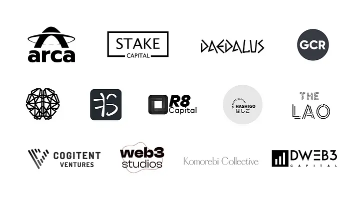

# Investors

Yes, we raised a pre-seed and [seed funding round](https://medium.com/goodghosting/completing-our-seed-funding-round-f41b9ce63bc4?source=friends\_link\&sk=b96b39eacd7a7db6b288cfa923a272a5) from a series of strategic investors.

<figure><figcaption>
Some of our seed investors
</figcaption></figure>

We are glad to be supported by:\
Arca Endeavor Fund, Big Brain Holdings, Cogitent Ventures, Daedalus Angels, dWeb3 Capital, Global Coin Research (GCR), Hashigo VC, Komorebi Collective, LongHash Ventures, Meta Change Capital, NxGen, R8 Block Capital, Stake Capital, Ternary Capital, web3 studios and ZMT Capital.\
\
Along with these outstanding Angel investors: Alastair Band (ex Boson Protocol), Amadeo Brands (DeFi Capital), David Truong (ex Aave), Eden Au (The Block), Larry Cermak (The Block), Lars Hoffmann (The Block), Mona El Isa (Avantgarde Finance), Sandeep Nailwal (Polygon) and Tegan Kline (Edge and Node).\
\
Read more in the announcement blog post below,


