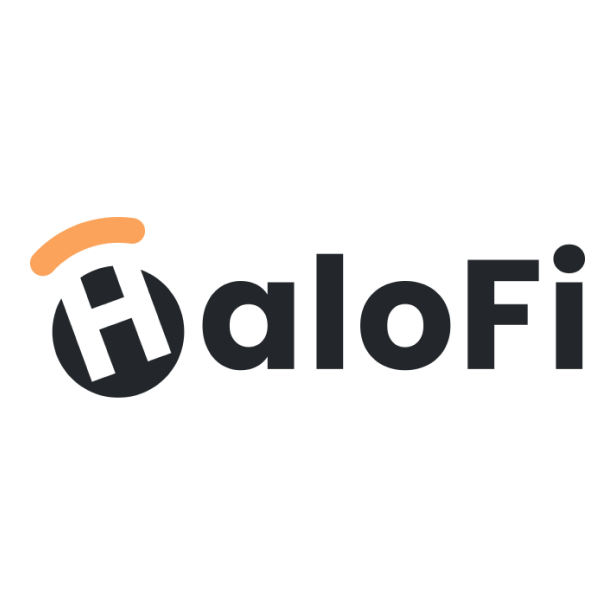
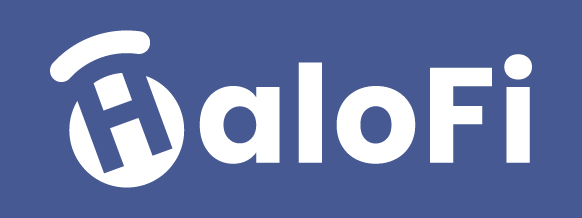

# Brand Kit & Guidelines


Below you can find our HaloFi [logos](brand-kit.md#logos), [icons](brand-kit.md#icons), [colors](brand-kit.md#h.gqx98cuoqbvn-1), as well as short text snippets. Feel free to use these on your own website, blog posts or press releases.


## Tagline 

> Be your best financial self

## Description 

> HaloFi helps you grow your wealth, step by step, with crypto. Whether you want to save regularly or hold onto your tokens for the long term, we've got you covered. Earn yield, badges, and more while completing our savings challenges. Hit your goals to get rewarded. Powered by smart contracts, HaloFi puts you in control of your future. Start your DeFi journey with HaloFi and become your best financial self today!

## Description (short) 

> Grow wealth with crypto, earn rewards, badges & more. Save like a boss with HaloFi. We make personal finance fun. Be your best financial self!

## Website 

> https://halofi.me

## Logos

Preferably use the full logo, unless there is insufficient space.  In that case, use the [icons](brand-kit.md#icons). Often, both rectangular, and square logos are provided.

### &#x20;For usage in a light theme (light background) 

#### Colour  

Rectangular (transparent background):  [Low res](https://www.google.com/url?q=https://drive.google.com/file/d/1v4zrjrZsf\_V1GHXWj7v2shlPCycdNyNg/view?usp%3Dshare\_link\&sa=D\&source=editors\&ust=1678291815880050\&usg=AOvVaw1Yik0ziRZT1DQvXfwIfmsv), [High res](https://www.google.com/url?q=https://drive.google.com/file/d/1UeLFeP6kfssf-3tBzywTnDyCYlYRf3i7/view?usp%3Dshare\_link\&sa=D\&source=editors\&ust=1678291815880479\&usg=AOvVaw14-Gcp1QDj\_-\_b5Cs8BDfp), [Vector](https://www.google.com/url?q=https://drive.google.com/file/d/1fnyA\_oFEG6huupNPMFordpi5lH4I5xe3/view?usp%3Dshare\_link\&sa=D\&source=editors\&ust=1678291815880754\&usg=AOvVaw2KjkyJ-L0xjPBHHlkW4GmF)\
Rectangular (white background): [Low res](https://www.google.com/url?q=https://drive.google.com/file/d/17BqFmd2RlT-hYp7PlVkjDSRiz-MTNdv2/view?usp%3Dshare\_link\&sa=D\&source=editors\&ust=1678291815881116\&usg=AOvVaw29c\_v6WF7Uv2jqyYF-9hIN)\
Square (white background): [Low res](https://drive.google.com/file/d/1OveQjP4sB2xtNH0eajc7exqyOXhqGkRk/view?usp=sharing)

#### Black

Rectangular (transparent background): [Low res](https://www.google.com/url?q=https://drive.google.com/file/d/14AKIfTlTNkD9X-e2Qvqlhe2O1dQHSqND/view?usp%3Dshare\_link\&sa=D\&source=editors\&ust=1678291815881709\&usg=AOvVaw26be77PZtMm5fvcYSb216H), [High res](https://www.google.com/url?q=https://drive.google.com/file/d/1yXbGARkup-oeDx7O9PM1ERGaZaf5-anF/view?usp%3Dshare\_link\&sa=D\&source=editors\&ust=1678291815882005\&usg=AOvVaw2n7xlfawhdrVvYSCuXf3T2)\
Square (transparent background): [Low res](https://www.google.com/url?q=https://drive.google.com/file/d/1g8RcHRNFkXp-Skay3WCPrubl0jnVU0wn/view?usp%3Dshare\_link\&sa=D\&source=editors\&ust=1678291815882346\&usg=AOvVaw3ZX6r6OBoPaV3axd1PB3Fr)\
Square (white background): [Low res](https://www.google.com/url?q=https://drive.google.com/file/d/11ANeYn\_teJgEgUtV96EdCa4yRFI3Xd3p/view?usp%3Dshare\_link\&sa=D\&source=editors\&ust=1678291815882735\&usg=AOvVaw3fBHPTEgzaATJl7Opao47t), [Vector](https://www.google.com/url?q=https://drive.google.com/file/d/1fDz0lOrTtqW5vylfg75ZiVxITRSrKS5q/view?usp%3Dshare\_link\&sa=D\&source=editors\&ust=1678291815883035\&usg=AOvVaw2\_2eASDSiowX0\_VDTg71cP)

###

### &#x20;For usage in a dark theme (dark background) or mixed context

#### **White-on-blue**&#x20;

&#x20;Rectangular: [Low Res](https://www.google.com/url?q=https://drive.google.com/file/d/1YSfXRvnEPehldzCo0rdZw8LCpe7OFFjW/view?usp%3Dshare\_link\&sa=D\&source=editors\&ust=1678291815883816\&usg=AOvVaw3EqfIAyIM7gyGAf5SA6zt4)

_**The square option is typically good for profile pics on social media, or other profiles.**_

Square: [Low res](https://www.google.com/url?q=https://drive.google.com/file/d/1XX-4MdIW3bWd\_MuCeF9GqwYlze4MxnMA/view?usp%3Dshare\_link\&sa=D\&source=editors\&ust=1678291815884362\&usg=AOvVaw3PQsa-8jMf-YV9z0ZPpZo5), [Vector](https://www.google.com/url?q=https://drive.google.com/file/d/1eHrKyt0rALA0pms6bpqGWqs6zz4iUXLK/view?usp%3Dshare\_link\&sa=D\&source=editors\&ust=1678291815884645\&usg=AOvVaw1Vt-f2Mp1oXsoocuUA\_fgp)&#x20;

\
**White-on-transparent**&#x20;

Rectangular: [Low Res](https://www.google.com/url?q=https://drive.google.com/file/d/1kQUTFfNHPFWKfmDQxkTLXcRxyQLWjlWl/view?usp%3Dshare\_link\&sa=D\&source=editors\&ust=1678291815885406\&usg=AOvVaw2QuMiDEeePcUlcgqr490Z9)\
Square: [Low Res](https://drive.google.com/file/d/1Rc1z4ZzvPljqjxTm2jHbEdDwDM5cYsKG/view?usp=share\_link), [Vector](https://www.google.com/url?q=https://drive.google.com/file/d/1vEJiWuboYpy5kypaEna8nVZaPVbmxDyb/view?usp%3Dshare\_link\&sa=D\&source=editors\&ust=1678291815885717\&usg=AOvVaw3m2vgkvrCC92IpJmmuGtIV)

## Icons

Only to be used when there is not enough space for the full logo.&#x20;

#### Colour

Square (transparent background): [Low res](https://www.google.com/url?q=https://drive.google.com/file/d/1nbXQJZr\_iH\_WtfgbxZIaztJKzpVFU2Kh/view?usp%3Dshare\_link\&sa=D\&source=editors\&ust=1678291815886300\&usg=AOvVaw0HFBFwbKnNSljjsgBFdYhE), [Vector](https://www.google.com/url?q=https://drive.google.com/file/d/10bseb1k5WbiXnne0ScEZso24ScXOo\_cT/view?usp%3Dshare\_link\&sa=D\&source=editors\&ust=1678291815886574\&usg=AOvVaw1m3GnbwEAR2JSzQlcnRKRY)\
Square (white background): [Low res](https://drive.google.com/file/d/1EleSHIOUMraBYjQ6rp71ujQ9kh69GNVp/view?usp=share\_link)

#### Black

Square (transparent background): [Low res](https://drive.google.com/file/d/1iLuT6F7Kpz7cM52RS77rlubI88oe69cl/view?usp=share\_link), [Vector](https://www.google.com/url?q=https://drive.google.com/file/d/1aJ0WiJyhT6Fnsee8oyXHW4lfOlM7ZR\_1/view?usp%3Dshare\_link\&sa=D\&source=editors\&ust=1678291815887429\&usg=AOvVaw3EVtkqVyfsYeu3ZXeQzPJ1)\
Square (white background): [Low res](https://drive.google.com/file/d/1tCedp6Rm31syJGXcd2uA7LWkDmZRwSZW/view?usp=share\_link)

#### White

Square (transparent background): [Low res](https://drive.google.com/file/d/1CcNuSUefNz0s4hnGNzJzkxIelwAWhVmM/view?usp=share\_link), [Vector](https://www.google.com/url?q=https://drive.google.com/file/d/1qAeHFeBzsXau6jB9rztfLO7vQCj2nAfN/view?usp%3Dshare\_link\&sa=D\&source=editors\&ust=1678291815888095\&usg=AOvVaw2Xc7teEEIaA3APFuAIthO2)\
\
**White on blue**\
Square (blue background): [Low res](https://drive.google.com/file/d/1m7QPE\_oLMmL1UyLv2QPtZ\_2Xy-d\_WvD-/view?usp=share\_link)

## 

## Colors 

Here are our main colors. They are used in eye catching and core part of our design.\
`#465992`, `#72CBC3`, `#FFCC66`, `#FBA35A`&#x20;

<figure><figcaption></figcaption></figure>

As a general rule, we use _grey-5_ (`#23272B`)for headings and _grey-4_ (`#454F58`)for body text.

<figure><figcaption></figcaption></figure>
