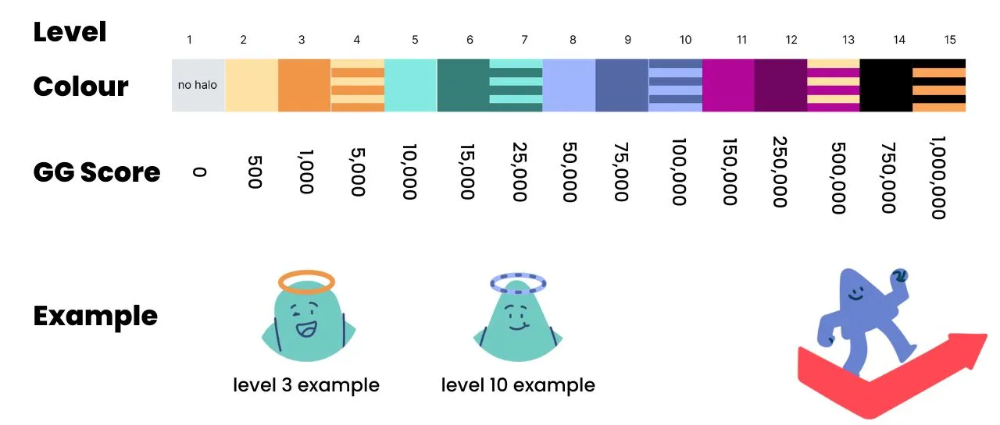
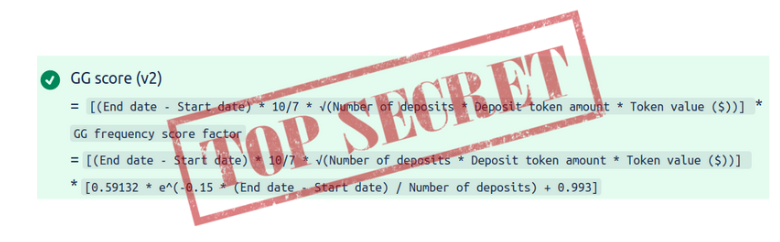

# HaloFi Heroes, Levels & GG Score

Halo Heroes are unique, triangle-shaped avatars that accompany each user on their HaloFi journey. These friendly characters represent your progress as you save and participate in challenges within the app.&#x20;

## Halo Heroes and their Levels

You can find your Halo Hero on your [dashboard](https://app.halofi.me/#/dashboard), the [leaderboard](https://app.halofi.me/#/leaderboard), and the players tab once you join a challenge.  But your Halo Hero is more than just a cute avatar. It represents your on-chain savings journey within HaloFi.&#x20;

As you accumulate GG Score points **by completing savings challenges, your Halo Hero's halo will change color** to showcase your progress. Initially, if you have less than 500 GG Score, you won't see a Halo at all. As you gain points, your Halo Heroes' halo progresses through different levels, with the higher your GG score, the more impressive your Halo becomes.  Check out the illustration below to see which Halo color corresponds to each GG score level. Black and gold halos are the rarest and have yet to be seen.

<figure><figcaption>
The color of the Halo will change, as you level up your savings skills!
</figcaption></figure>

## Understanding GG Scores

GG Scores are the heart of the HaloFi point system. They are designed to measure and reward your savings accomplishments. The more savings challenges you complete, the higher your GG Score becomes. As your GG Score increases, so does the prestige of your Halo Hero's halo, creating a fun and engaging way to track your progress within the HaloFi community.

### GG score calculation

Once a savings challenges is fully completed, inducing the final waiting round, your GG Score is updated on our website. Your overall GG Score is the sum of all individual GG Scores you've earned by completing challenges.

To determine your overall GG Score, we first need to calculate your individual savings challenge scores. Each savings challenge has unique characteristics, such as varying durations and deposit amounts. To account for these differences, we calculated a unique GG Score for each challenge by initially multiplying the _pool's duration (in weeks)_ by _the square root of the total value ($) of all required deposits_\*. Consequently, **the more HaloFi challenges you complete and the more funds you save through the protocol, the higher your score will be.**

\*We initially launched the GG Score system [back in September 2021](https://medium.com/halofi/launching-the-gg-score-66acd783dd53) and continue to evolve it alongside our saving challenges. In our continuous effort to improve user experience, we have revamped how we calculate GG Scores. In addition to considering deposit amounts and pool lengths, **we now also factor in deposit frequency and how early you deposit each segment.** With more frequent deposits, and early deposits, getting a small bonus due to their higher difficulty of completing these challenges. By updating the GG Score calculation, we're ensuring **a fair and transparent system that accurately reflects your savings journey.**&#x20;

<figure><figcaption></figcaption></figure>

Technical details 

In technical terms, we utilize the `playerIndexSum` divided by the `maxPIS` (see [Technical docs](technical-documentation/)),  to determine how long you had funds deposited in the savings challenge  - relative to others in the same challenge. The higher this number, the bigger your portion of the total GG score of that savings challenge.\
\
To factor in deposit frequency, we use the formula: Frequency score factor = `0.59132 * e^(-0.15 * (End date - Start date) / Number of deposits) + 0.993`. This results in:

* no bonus for monthly deposit frequency pools (1x)
* 6.5% bonus for biweekly deposits (1.065x)
* 20% bonus for weekly deposits (1.2x)
* 50% bonus for daily deposits (1.5x)
* 0.7% penalty for challenges with multi-month frequency

To dampen big deposits, we don't calculate the GG score linearly based on $ value deposits but rather use the square root. Specifically: `10*√(total $ deposit)`. This means that for deposits higher than $100, the reward in GG score will be sublinear. Essentially, someone would have to increase their deposit size by 1000x, to realize a 10 increase in GG score (compared to other depositors in the same challenge). This avoids the unfair situation wherein a single big depositor could rack up a huge GG score.

## The Lore of Halo Heroes

The story of Halo Heroes originated during DeFi summer, when a friendly ghost sought to spread the word of crypto. The ghost encountered a young Halo Hero eager to learn about saving and investing. Together, they learned all they could about decentralized protocols like Aave, Moola, Curve, and everything DeFi. They devised fun ways to help people save crypto daily, weekly, or monthly. Over time, the Halo Heroes grew in number and skill, eventually surpassing the ghost in knowledge and expertise. Recognizing their power, the ghost passed on his precious halo, bestowing its color-changing powers upon the Halo Heroes. This marked the birth of HaloFi.



## Sharing Your Halo Heroes

We understand that saving crypto is a great accomplishment, and we want to help you share your success with the world. That's why we created shareable profile pages, allowing you to showcase your Halo Heroes, badges, and HaloFi achievements with your friends and followers on social media.


To share your Halo Heroes, simply head over to your dashboard and click the "Share on Twitter" icon. Share your savings goals and tell us why your Halo Heroes is the best, and we'll be retweeting our favorites. It's a great way to celebrate your progress and inspire others to start saving, too.

