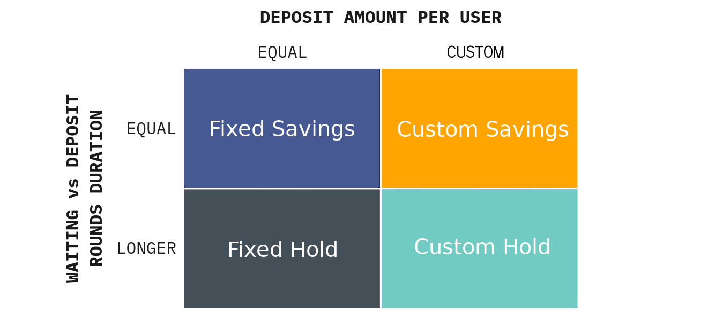

# Challenge Types


HaloFi is a unique savings concept that offers **four broad types** of challenges. These are suited for different types of users, and each come with their own set of benefits. \
\
Choosing the right challenge depends on your goals and savings habits. If you prefer to make frequent deposits, both the Custom and Fixed savings challenges may be suitable options. If you're looking for a long-term investment, one of the Hold challenges could be a better fit.&#x20;


## Four challenge types

In this section, we explain the four different type of challenges that are available in HaloFi. \
These are different game types, each with their own set of rules and requirements.

* [Fixed Savings](challenge-types.md#fixed-savings)&#x20;
* [Custom Savings](challenge-types.md#flexible-savings)
* [Fixed Hold](challenge-types.md#3.-fixed-hodling)&#x20;
* [Custom Hold](challenge-types.md#4.-flexible-hodling)

They can be split up based on two criteria:  \
\- Whether or not a user can freely chose how much they to deposit when joining the challenge \
\- Whether or not there is a long "waiting round" at the end of the challenge

<figure><figcaption>
Four distinct type of challenges in HaloFi
</figcaption></figure>

### **1. Fixed Savings** 

This type of challenge follows the same principal as our [V1 Pools](https://app.gitbook.com/s/yEEvzWYNy0G7zbGeDjkt/guarded-launch), with a fixed deposit amount for all players. Each user will be engaging in exactly the same savings challenge. The waiting round at the end of the challenge, is the same length as each of the deposit rounds.&#x20;

`Deposit amount ($):`` `**`fixed`**` ``(equal) for all players`\
`Rounds duration:`` `**`equal`**`deposit round and waiting round length`\
\
_**Example**: a challenge where everyone commits to depositing 20 USDC each week. The final deposit is followed by a one week waiting round, before funds can be withdrawn._\

### **2. Custom Savings** 

This challenge allows for custom deposit amounts - allowing users to choose the total amount of money they would like to save. All users can decide how much they want to deposit each segment, at the time of their first deposit. _Once the challenge has been joined with a specific deposit amount, all next deposits (for that user) in that challenge will have to be of the same amount._&#x20;

`Deposit amount ($):`` `**`flexible`**` ``(decided by each player when joining)`\
`Rounds duration:`` `**`equal`**`deposit round and waiting round length`&#x20;

_**Example**: a challenge where each joiner can set the amount of USDC they would like to deposit each week. Karen commits to saving 5 USDC a week, whereas Chad commits to saving 500 USDC weekly. The final deposit is followed by a one week waiting round._

### **3. Fixed Hold**

For Holding challenges, there are one or more deposit rounds, which are followed by a waiting round with an identical or a longer duration.  _This makes it easier for someone to commit to long-term holding a certain token. It also reduces the number of smart contract interactions._\
These can also be considered "Staking pools" or "Staking challenges".&#x20;

`Deposit amount ($):`` `**`fixed`**` ``(equal) for all players`\
`Rounds duration:`` `**`a longer waiting round`**`than deposit round`

_**Example**: a challenge where everyone is required to deposit 0.01 ETH weekly, during four weeks. The final deposit is followed by a three month waiting round, before funds can be fully withdrawn._\

### **4. Custom Hold**

Similar to Fixed Holding, but with custom (flexible) deposit amounts. The deposit amount (for each segment) is decided by each player when initially joining the challenge

`Deposit amount ($):`` `**`flexible`**` ``(decided by each player when joining)`\
`Rounds duration:`` `**`a longer waiting round`**`than deposit round`

_**Example**: a challenge where Karen commits to saving 0.05 ETH monthly and Chad commits to saving 1 ETH monthly, for three months in a row. The final deposit is followed by a six month waiting round, before funds can be fully withdrawn._

## **Combining challenge types with yield strategies**

Every HaloFi challenge needs to be combined with one yield strategy.

Each of the four challenge types can be combined with any of the available [yield-generating](yield-strategies.md#different-yield-strategies-explained) strategies, as well as a [No Yield](yield-strategies.md#curve-aave-stable) strategy. Which strategy can be chosen, will depend on the underlying asset that is used to save in (i.e. supported savings currency). The combination of chosen yield strategy and savings currency, will determine the ultimate [risk profile](../risks.md) of each challenge.

The challenge type, savings currency and strategies are determined at time of pool deployment. They cannot be changed after the smart contract has been deployed.&#x20;

_More details on our Github:_


