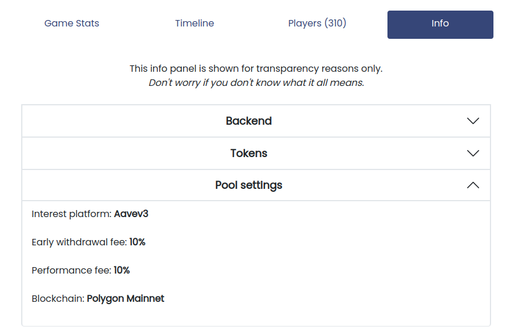

# Fees

### Fees charged by a savings challenge

#### Early withdrawal fee

At HaloFi, we want to encourage people to create the good habit of saving towards a personal goal. However, we understand that personal situations can change, and sometimes you may need immediate access to your funds. That's why our smart contracts allows players to withdraw their funds at any time before the end of a challenge. You can do this easily by clicking on the `Early Withdraw` button in the user interface, or calling the `earlyWithdraw` function on the smart contract.

However, please note that if you decide to withdraw early, you will forfeit any earned rewards and pay an "early withdrawal fee" to the savings challenge smart contract. This fee compensates the remaining players in the challenge for the loss in rewards that would have been generated from your participation. The fee is then left in the challenge smart contract and distributed among all winning players at the end of the challenge.\
\
It's important to keep in mind that if you wait until the end of the game to withdraw, you won't have to pay any fees to withdraw your funds.


_**How much is the early withdrawal fee?**_  \
The early withdrawal fee is set when the smart contract is deployed and typically amounts to around **5%** of the total amount of funds deposited by a player. This fee is defined in the smart contract's constructor during deployment and cannot be changed once the game has started.


Example

* Chad deposited 100 DAI into a HaloFi savings challenge with an early withdrawal fee of 5%
* Chad decides to withdraw early and clicks the "Withdraw Early" button on the user interface, and confirms the `earlyWithdraw` transaction
* Chad immediately receives back 95 DAI, while 5 DAI remains in the savings pool as an early withdrawal fee.
* At the end of the challenge, the remaining 5 DAI is distributed between all winning players as a part of their earned rewards.

### Fees charged by HaloFi

#### Performance aka admin fee&#x20;

While most of our services are currently free of charge, some of our challenges do charge a performance fee on the rewards generated by the savings pool smart contract. This fee is also known as the `adminFee`. This fee is set during the deployment of the smart contract, and cannot be changed retroactively. It is is typically set at 10%, but it can vary depending on the challenge.\
\
The fee is only charged on the `totalGameInterest` and `rewardTokens` generated by the savings pool strategy and not on the initial deposits (`totalGamePrincipal`) or any additional incentive tokens added to the pool (`incentiveToken`). This means that the fee will **o**nly be charged if the pool is profitable.


You can check whether a performance fee is active by navigating to the "Info" tab in the user interface, or by reading the `adminFee function` in the smart contract.


<figure><figcaption>
Example of the 'Info' tab, where you can find whether a specific savings challenge has a performance fee enabled.
</figcaption></figure>

Example

* Sarah joins a savings challenge on HaloFi with a performance fee of 10%
* Over the course of the challenge, Sarah deposits a total of 200 DAI, which  generates a corresponding increase in `totalGameInterest` of 10 DAI.
* The adminFee charged on the generated interest is 10% or 1 DAI
* At the end of the challenge, the total amount that can be withdrawn by Sarah is 218 DAI (her principal of 200 DAI plus the generated interest of 10 DAI minus the admin fee of 1 DAI).
* The rewards are distributed among all the winning players based on their performance in the challenge.\

<!---->

* Chad immediately receives back 99 DAI, while 1 DAI remains in the savings pool as an early withdrawal fee.

#### Management fee

Please note that we do not charge any management fees.

#### Challenge configuration fee

We offer communities the ability to create their own fully configurable savings and investment challenges. This is a paid service, available [upon request](https://form.typeform.com/to/ksiZyELu), and the pricing may vary based on the requirements of the community. We will provide a transparent breakdown of all the costs associated with the deployment and maintenace of the challenge.&#x20;

### Transaction fees on Polygon and Celo

The Polygon and Celo networks require transaction fees to be paid in the form of MATIC and CELO tokens, respectively, for all transactions and smart contract interactions. These fees vary based on the complexity of the transaction, with more complex transactions requiring a higher fee. The purpose of these fees is to ensure the integrity and security of the network. It's worth noting that these fees do not go to HaloFi, but to the entities that run these networks (e.g. validators).

Compared to other blockchain networks like Ethereum and Bitcoin, the transaction fees on Polygon and Celo are significantly lower. This makes these networks more cost-effective for users, allowing for cheaper and faster transactions. At the time of writing, you can complete a full HaloFi game for less than $0.01 worth of CELO tokens.


We are committed to transparency and providing a reliable service to our users. If you have any questions or concerns regarding our fees or revenue model, please do not hesitate to contact us by [email](mailto:hello@halofi.to) or [Discord](https://discord.gg/Y6bPpwbpK3).

