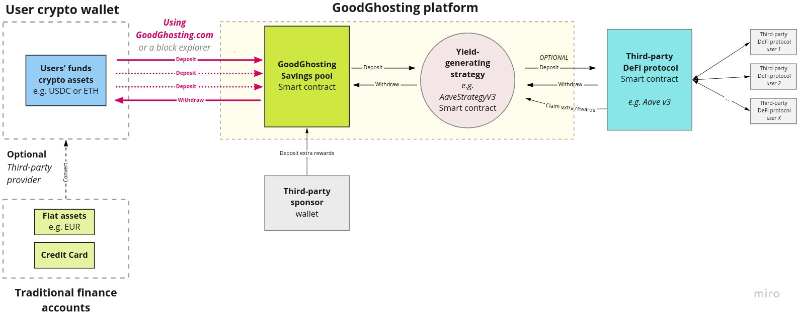

# Savings Challenge Mechanics


We use game-design elements to reward users who hit their savings target (i.e. winners) more so than users who do not. This happens transparently on a public blockchain.


## 🕹️ **Game mechanics**

For each game (also referred to as _challenge or pool_), a new savings challenge smart contract is deployed by the HaloFi team. Each challenge  runs for a **fixed amount of time**. There are always one or more deposit rounds - where you deposit a specific digital asset into the savings challenge smart contract - followed by a single waiting round.&#x20;

**To win, players need to complete all deposits.** Aka: they need to make a deposit into the challenge smart contract every round, prior to the round’s deadline.  At the end of the challenge, all players can withdraw their initial deposit (minus any [impermanent loss](slippage-and-impermanent-loss.md)), irrespective whether they won or not. &#x20;

**Winners earn a slice of the challenge's rewards**. This includes any interest generated through decentralized finance platforms as well as additional incentives and sponsorship (see [yield-strategies.md](yield-strategies.md "mention") and [..](../ "mention")). The rewards are proportional to how much and when a user deposited. Typically, **winners** **earn more than when they would save by themselves.**&#x20;

The rewards are proportional to how much and when a user deposited. Typically, **winners** **earn more than when they would save by themselves.** \

## ⚙️ **Technical**

Deposit tokens

On a technical level, deposits take place in ERC-20 tokens. These can be digital stablecoins (such as [DAI](https://community-development.makerdao.com/en/learn/Dai/), [USDC](https://www.circle.com/en/usdc) or [cUSD](https://blog.celo.org/celo-dollars-powerful-new-digital-money-in-circulation-b4147eda2d10)) whose value is soft-pegged to fiat currency (e.g. the US Dollar) and which can be transferred to our saving challenge smart contract, using blockchain technology. Additionally, we  support most of the other ERC-20 tokens (including most volatile tokens) that are available on the [Celo](../../hub/getting-started/getting-cryptocurrency-tokens/obtaining-celo-cusd-ceur-and-other-celo-tokens.md) and [Polygon](../../hub/getting-started/getting-cryptocurrency-tokens/obtaining-matic-usdc-dai-weth-and-other-polygon-tokens.md) blockchains.&#x20;

_Note that all users in a specific challenge, are required to deposit the same ERC-20 token which is defined by `inboundToken`._

Deposit amounts

We support both challenges with a fixed deposit amount (identical for each user), as well as challenges with flexible deposits (unique for each users). \
\
When flexible deposits are enabled (`flexibleSegmentPayment = true)`, everyone can decide how much they want to deposit into a HaloFi challenge. _Once a users joins the challenge with a specific deposit amount, all next deposits in that challenge will have to be of the same amount. This is defined by `depositAmount`. For challenges with flexible (custom) despoit amounts, there can be a maximum deposit limit per player, defined by `maxFlexibleSegmentPaymentAmount`._

Challenge duration

The duration of both the deposit and waiting round are determined at time of challenge creation. This means each challenge has a predictable fixed end date. Deposit rounds can have a different duration (`segmentLength`) than the final waiting round (`waitingRoundSegmentLength`), which enables different [Broken link](broken-reference "mention") with interesting dynamics.


[challenge-types.md](challenge-types.md)


### Rewarding early depositors (Rewards calculation)

Reward distributions are taking into account the total time (and amount) a user has funds deposited into a savings challenge. Thereby increasing fairness to all depositors.  \
The sooner a player deposits in each segment, the bigger their share of the challenge's generated interest and rewards in that segment _- assuming they are considered winners at the end of the challenge_.  Typically, a winning user (who deposits during the very first block of a deposit segment) can earn up to a factor of 2 more the rewards compared to another user (who deposits during the very last block of a deposit segment). On the smart contract level, this is tracked using `cumulativePlayerIndexSum` and `playerSharePercentage`. This is updated for every new deposit for each segment. For the _waiting round,_ rewards are calculated according to the total amount of funds a user has deposited (since each user starts this round at the same time).&#x20;

See [Broken link](broken-reference "mention")to learn more about how rewards are generated.


[yield-strategies.md](yield-strategies.md)


### Smart contract code


Check out our Github


### Smart contract overview

In order to make the contracts modular, the contracts are divided into two types:&#x20;

1. The **challenge contract** that holds all the core game/pool logic  ([Pool.Sol](https://github.com/Good-Ghosting/goodghosting-protocol-v2/blob/master/contracts/Pool.sol))\
   _It is the main contract through which players are able to make deposits into the underlying yield strategy contract and withdraw funds._\

2. The **yield strategy** **contracts** that hold the logic to integrate with the external protocols.   \
   _The strategy contract is owned by the challenge contract. Thereby only the challenge contract can directly interact with the strategy contract, not players or any other external actors._

There are multiple yield strategy contracts [available](https://github.com/Good-Ghosting/goodghosting-protocol-v2/tree/master/contracts/strategies), but each challenge contract can only be coupled to one strategy at a time. This is determined at the time the challenge contract is deployed. Hence, the yield source becomes fixed at the time of pool deployment.

### Flow of Funds

<figure><figcaption>
Flow of user funds in HaloFi
</figcaption></figure>

### Public functions

Commonly used functions by users

The initial deposit happens by calling the `joinGame()`function on our challenge smart contract ([Pool.sol](https://github.com/Good-Ghosting/goodghosting-protocol-v2/blob/master/contracts/Pool.sol)). Subsequent deposit happen via the `makeDeposit()`function.\
\
`withdraw()` - Allows player to withdraw their funds after the game ends. Losing players pay no fee and receive their initial deposit back (minus any [IL](slippage-and-impermanent-loss.md) if applicable). Winning players get their initial deposit back (minus any IL or [performance fee](fees.md#performance-aka-admin-fee), if applicable) and a share of the earned rewards, based on the `cumulativePlayerIndexSum`.

`earlyWithdraw()` - Allows a player to withdraw their funds before the game ends. An [early withdrawal fee](fees.md#early-withdrawal-fee) is charged, as defined in the constructor. IL is also taken into consideration (if applicable for the used yield strategy), prior to the user receiving the remaining portion of his funds. This function can be called any time prior to the end of the game, and results in the player exiting the savings challenge. _If the game is still in the first segment, a user can still re-join the challenge._

### Admin functions

Our challenge smart contract contain multiple administrative functions, that are only accessible to the admin (owner) of the contract. &#x20;

Related to emergency scenarios 🚨

Certain admin functions are present, to allow to react to emergency scenarios. Typically these avoid user funds getting stuck in the strategy contract, or avoid further deposits. Find below more information about each of these administrative functions and how they impact and limit the game.

`pause()` - This pauses new deposits into the challenge, as well as early withdrawals. Specifically, the only function that still can be executed by users is `withdraw()`, after the game has ended. _It does not result in the early completion of a game. Hence, if there are still deposits left to be made, those players will be considered a losing player. But at least it ensures that all players can withdraw their funds after the game has ended._

`unpause()` - This allows the admin to resume the game. It re-enables `joinGame`, `makeDeposit` and `earlyWithdraw`.

`disableClaimingRewardTokens()` - This disables the claiming of external reward tokens. This is useful when external reward contracts become inactive or reward balances aren't available, avoiding user funds getting stuck in the strategy and/or challenge contract.

`enableEmergencyWithdraw()` - This enables for the early completion of a game, in case of an [emergency situation](https://github.com/Good-Ghosting/goodghosting-protocol-v2#emergency-scenario). Once called, it updates the last segment value to current segment and sets the emergency flag to `true` in the smart contract. This allows players to withdraw their funds (via the standard `withdraw()`), along with rewards for winners. Players will be considered winners if they have deposited either in the current and/or previous segment. _Hence, it results in the early completion of an ongoing game, without forcing players to become 'losing' players._

General admin functions

`adminFeeWithdraw()` - Allows the admin to withdraw the performance fee, if applicable. This function can be called only once, and only by the contract's admin and only after the game has ended.

`lowerEarlyWithdrawFee()` - Allows the admin to set a lower early withdrawal fee by specifying  `newEarlyWithdrawFee`.

`setIncentiveToken` - _<mark style="color:orange;">To add explanation</mark>_

<mark style="color:orange;">// To add remaining admin functions //</mark>

Who is the admin?

Upon initialization, the admin is the HaloFi-owned address (EOA) that deployed the contract to the blockchain. Soon after deployment, the ownership typically gets transferred to a HaloFi-controlled Safe multisig wallet. Example of such a wallet for [Celo](https://safe.celo.org/mainnet:0xEbCdA35beBe9Fc3AD2D2c75B84BBb13418bb2E95/home) and [Polygon](https://gnosis-safe.io/app/matic:0x46f8B0628E52881F25e355518A16DA487A4bc893/home).

