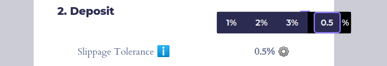
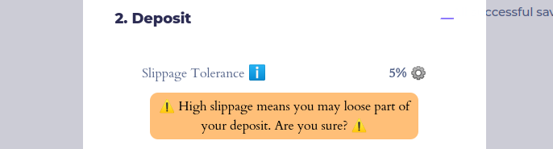
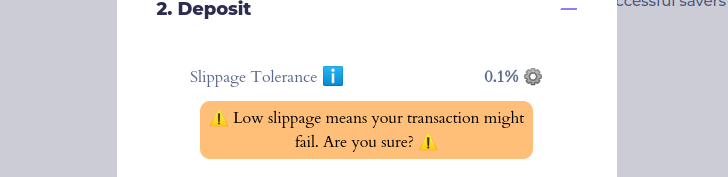

# Slippage and Impermanent Loss

Some HaloFi pools use an [automated market maker (AMM)](https://www.gemini.com/cryptopedia/curve-crypto-automated-market-maker) strategy to generate rewards. Examples of AMMs used in such strategies are Curve Finance and Mobius Money. These HaloFi strategies have extra risks due to slippage, price impact and impermanent loss.\
Below we provide a brief explanation of these concepts and risks.


**There can be a net loss of value for users, when using such a** [**Medium**](https://docs.goodghosting.com/docs/security/risk-categories#medium-risk) **or** [**High**](https://docs.goodghosting.com/docs/security/risk-categories#high-risk) **risk HaloFi savings pools.** Luckily, slippage, price impact and/or permanent loss are most often offset by earned trading fees and/or other rewards generated by the strategy.


## Slippage and price impact

In the context of AMMs, _**price impact**_ refers to the direct effect of an individual order (e.g. a deposit or withdrawal) on the market price of an underlying liquidity pool.&#x20;

When a deposit or withdrawal is made to an AMM liquidity pool this may influence the price of the deposited asset in the pool. This can result in either a negative price impact (i.e. a partial loss of funds) or a positive price impact (i.e. a partial gain of funds). Price impact depends on the size of the order compared to the pool's liquidity. Especially in AMM pools with low liquidity, there is a higher chance for depositors to lose a part of their funds due to price impact.

_**Slippage**_ refers to the discrepancy between the anticipated price of an order and the actual price at which the order is executed. Almost all AMMs are subject to slippage due to front-running, since there is a delay between the order submission and execution. This makes an order vulnerable to execution at a higher (or lower) price than anticipated. Often, a maximum slippage setting can be configured to limit potential losses. Although slippage can be positive as well. This happens when the market rate changes to a more favorable direction between order submission and execution. &#x20;

_Price impact and price slippage are thus very similar but not identical. Price **slippage** refers to the change in price caused by external broad market movements (unrelated to your order), while **price impact** refers to the change in price directly caused by your order itself._&#x20;


_Learn more about slippage and price impact here_


### _How to control slippage on_ HaloFi

**To avoid unexpected losses due to price slippage or price impact, we enable a "Slippage Tolerance" setting for all HaloFi pools that use an AMM strategy.**\
\
You can configure the maximum slippage that you are willing to accept. This can be done prior to each deposit, as well as for early withdrawals. To access this feature, please click the cogwheel (⚙️) to input your preferred Slippage Tolerance value.\
\
_The higher the value, the more loss due to slippage you are willing to tolerate. For example setting the value to 0.5%, means you agree to losing up to 0.5% of your deposit value due to slippage. If the real slippage is higher than this, your transaction will not confirm successfully (i.e. revert)._

<figure><figcaption>
Example when entering a custom slippage tolerance
</figcaption></figure>

<figure><figcaption>
Example when entering a very high slippage tolerance
</figcaption></figure>

<figure><figcaption>
Example when entering a very low slippage tolerance
</figcaption></figure>

_<mark style="color:red;">When changing this setting, please double-check whether your transaction was confirmed successfully.</mark> If not, please change the inputted value or try again later. Only successful transactions will be eligible to partake in HaloFi savings pools._

## Impermanent loss

Besides the aspect mentioned above, there is also the risk for impermanent loss. \
Impermanent loss happens when you provide liquidity to an AMM pool, and the price of the underlying assets in the pool changes during the period between deposit and withdrawal.\
\
This is especially relevant for the [**High**](https://docs.goodghosting.com/docs/security/risk-categories#high-risk) **risk HaloFi pools** _(utilizing a non-stableswap AMM  strategy_). And to a lesser extent also for [**Medium**](https://docs.goodghosting.com/docs/security/risk-categories#medium-risk) **risk pools** (_when utilizing a StableSwap AMM strategy)._

**Hence, the underlying value at the time of withdrawal **_**from such a**_** HaloFi savings pool might be smaller, than the combined value deposited into the HaloFi pool by a user.** In other words: you can end up with fewer tokens than you initially deposited.

\
**EXAMPLE A**\
A HaloFi user wants to join a 'Medium risk' savings pool with a Curve 'Aave pool' strategy. _When making a DAI stablecoin deposit into the pool, the deposit gets forwarded to Curve and split across three different coins in the underlying Curve StableSwap pool. This means the user now has exposure to price fluctuations of all three of the underlying assets: DAI, USDC and USDT. When the price of any of these stablecoins strongly diverges from the others (i.e. one loses peg), a loss of funds can take place when the funds are again withdrawn from the strategy. Hence, the user might get back a lower quantity of the same stablecoin than was deposited. Typically, this loss is largely offset by increased trading fees and/or additional rewards generated by the strategy._ HaloFi _users in Medium risk pools are only expected to be negatively effected by impermanent loss in a minority of cases. Nonetheless, a permanent loss of a stablecoin peg can result in significant losses._\
\
\
To learn more:





