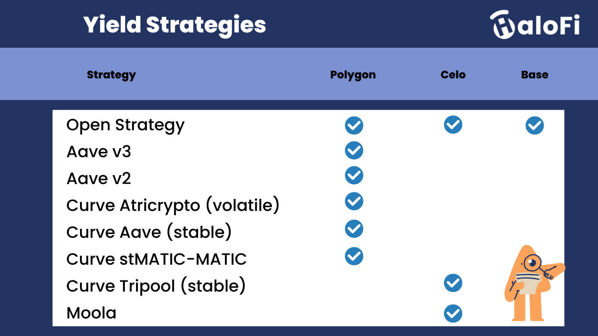

# Yield Strategies


More strategies are being developed. Is there a specific strategy you would like to see on HaloFi, [let us know here](https://goodghosting.typeform.com/to/URhXgzXZ).


<figure><figcaption></figcaption></figure>

## Different yield strategies explained

### **Open Strategy**

In this strategy, no third-party protocols are used. Hence, a users' funds will remain in the HaloFi smart contract, and not be moved into any third-party protocol. This enables the creation of savings pool denominated in (almost) any ERC-20 token that is available on our supported blockchain networks. _This strategy still allows additional incentive tokens to be added to the pool, to be shared between all winning players._

<strong>Supported assets</strong>

Most available ERC-20 tokens on Celo, Polygon and Base are supported.

Unsupported assets

Tokens with a built-in 'Burn on transfer' or 'Fee on transfer' are not supported. Neither supported are ERC-721 tokens, ERC-1155 and most other token standards.


Smart contract code - NoExternalStrategy.sol


### **Aave v3**

Interacts with the Aave V3 protocol (or forks) to generate lending interest and additional incentive rewards for the HaloFi challenge.  Deposits funds from the HaloFi challenge contract into Aave v3 contracts, and withdraws them again. Any incentive reward tokens are not converted, but rather distributed back to users as is. Available on Polygon.

<strong>Supported assets</strong>

agEUR, DAI, EURS, jEUR, USDC, USDT, MAI (miMatic), AAVE, BAL, CRV, DPI, GHST, LINK, SUSHI, WBTC, WETH, MATIC, MaticX, stMATIC, WMATIC (on Polygon)  [\[Source\]](https://app.aave.com/markets/?marketName=proto\_polygon\_v3)


Smart contract code - AaveStrategy.sol



We are working to enable Aave strategies on the Base blockchain, as soon as Aave v3 becomes available on Base.


### Aave v2 & Moola&#x20;

Interacts with the Aave V2 protocol (or forks such as Moola) to generate lending interest for the HaloFi challenge.  Deposits and withdraw funds from the HaloFi challenge contract into Aave v2 contracts. Any incentive reward tokens are not converted, but rather distributed back to users as is.

Supported assets

* &#x20;DAI, USDC, USDT, AAVE, BAL, CRV, DPI, GHST, LINK, SUSHI, WBTC, WETH, MATIC, WMATIC (on Polygon) \[[Source](https://app.aave.com/markets/?marketName=proto\_polygon)]
* cUSD, cEUR, cREAL (on Celo) \[[Source](https://app.moola.market/)]


Smart contract code - AaveStrategy.sol


### **Curve**

Interacts with the Curve Finance protocol to earn swap fees, lending interest and additional incentive rewards. This strategy depositing funds from the challenge contract into Curve StableSwap or Curve volatile pools, and withdraws them again in the same initial currency. Any token incentives are distributed as is (e.g. CRV tokens). Current pools supported are the [AAVE StableSwap Pool](https://polygonscan.com/address/0x445FE580eF8d70FF569aB36e80c647af338db351), the [Atricrypto volatile Pool](https://polygonscan.com/address/0x1d8b86e3d88cdb2d34688e87e72f388cb541b7c8) and the [stMATIC StableSwap Pool](https://polygon.curve.fi/factory-crypto/13) on Polygon. We [recently](https://medium.com/halofi/boost-your-cusd-returns-with-halofi-e50b1095fc72?sk=b523f16b9a2e7376b46179a146f729ba) also added support for the [Tripool (stablecoin) Pool](https://curve.fi/#/celo/pools/factory-v2-1/deposit) on Celo.


We are working to enable Curve strategies on the Base blockchain, as soon as Curve Finance becomes available on Base.


These strategies are subject to [slippage and impermanent loss](broken-reference). \

Curve Aave (Stable)

This strategy has price exposure to the three largest stablecoins on Polygon: DAI, USDC and USDT. This strategy uses a Curve lending pool, which means it earns interest from lending as well as trading fees. It also earns CRV token incentives.\
\
External link: [https://polygon.curve.fi/aave](https://polygon.curve.fi/aave) \
Supported assets: DAI, USDC, USDT (on Polygon)\
\
\
_The main risk is the permanent loss of a stablecoin peg. If one of the stablecoins in the Curve pool goes significantly down below the peg of 1.0 and does not return to the peg, it'll effectively mean that the strategy holds almost all its liquidity in that currency. When a user then withdraws their funds from the challenge again (and the depegged currency is different from the one initially used to deposit into HaloFi) it could mean that a user gets back fewer tokens than were initially deposited._

<strong>Curve Atricrypto (Volatile)</strong>

This strategy has price exposure to the three largest stablecoins (DAI, USDC and USDT) as well as to Bitcoin and Ethereum, on Polygon.  Note that his pool is continuously rebalancing and these are volatile assets. Hence, it is a [high risk](broken-reference) strategy. This strategy uses a Curve lending pool, which means it earns interest from lending as well as trading fees. It also earns CRV token incentives.\
\
External link: [https://polygon.curve.fi/atricrypto3](https://polygon.curve.fi/atricrypto3)\
Supported assets: DAI, USDC, USDT, WETH, WBTC (on Polygon)

<strong>Curve stMATIC-MATIC (Stable)</strong>

This strategy has price exposure to staked MATIC (by [Lido Finance](https://lido.fi/polygon)) and MATIC. These are volatile assets. Hence, it is a [high risk](broken-reference) strategy. This strategy uses a Curve StableSwap pool on Polygon, which means it earns interest from trading fees. It also earns LDO and/or CRV token incentives.

External link: [https://polygon.curve.fi/factory-crypto/13](https://polygon.curve.fi/factory-crypto/13)\
Supported assets: stMATIC, MATIC (on Polygon)

Curve Tripool (Stable)

This strategy has price exposure to the three largest stablecoins on Celo: cUSD, USDC (bridged via Wormhole) and USDT (bridged via Wormhole). This strategy uses a Curve StableSwap pool, which means it earns additional LP tokens from trading fees. It also earns CRV token incentives.\
\
External link:  [https://curve.fi/#/celo/pools/factory-v2-1/deposit](https://curve.fi/#/celo/pools/factory-v2-1/deposit) \
Supported assets: cUSD, USDC (Wormhole), USDT (Wormhole) - (on Celo)\
\
\
_The main risk is the permanent loss of a stablecoin peg. If one of the stablecoins in the Curve pool goes significantly down below the peg of 1.0 and does not return to the peg, it'll effectively mean that the strategy holds almost all its liquidity in that currency. When a user then withdraws their funds from the challenge again (and the depegged currency is different from the one initially used to deposit into HaloFi) it could mean that a user gets back fewer tokens than were initially deposited._


Smart contract code - CurveStrategy.sol


You can learn more about how Curve Finance works below:


