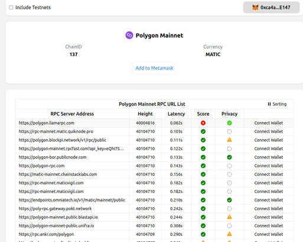
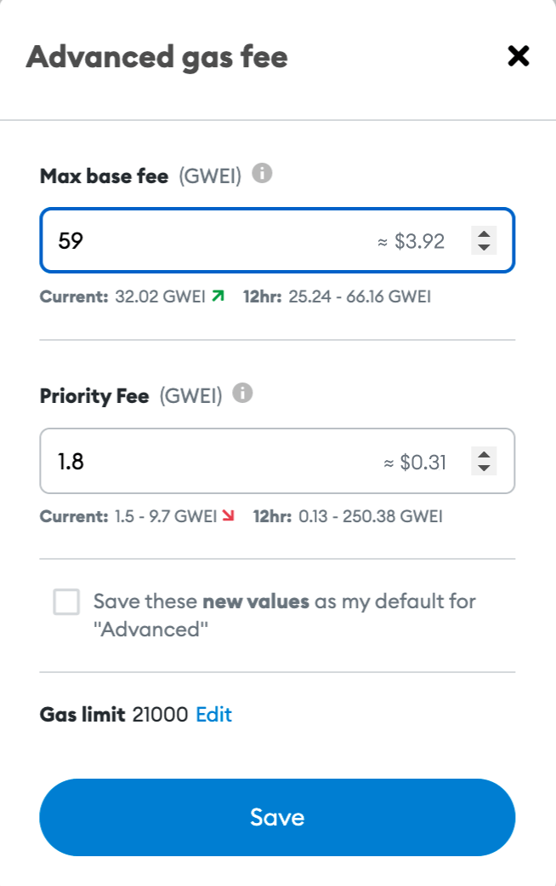
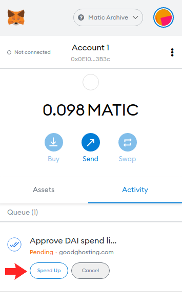
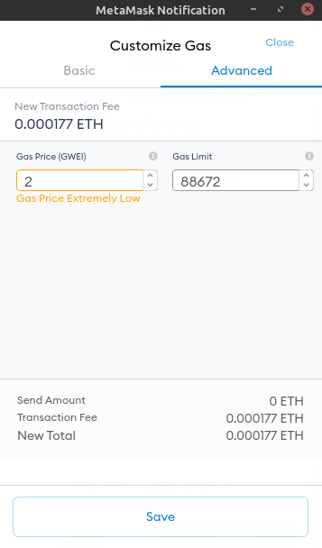
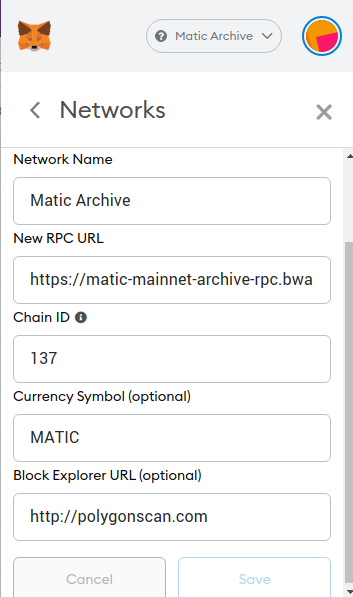
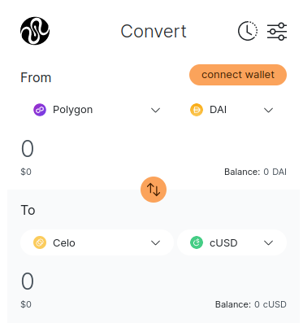
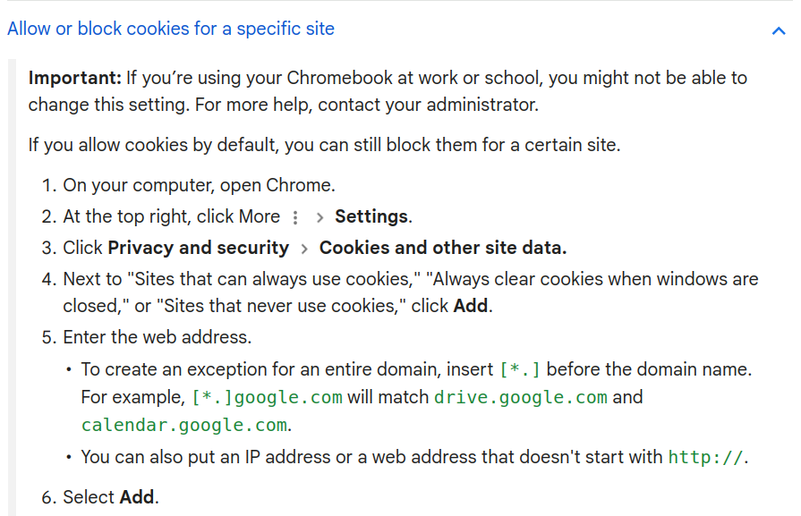

# Troubleshooting

As we continue to improve and develop our software using experimental blockchain technology, we understand that you may encounter occasional bugs or issues with the user interface or third-party providers. To help you navigate these challenges, we've compiled a list of known issues and their solutions

## Known issues and Solutions


* Out of Gas: no MATIC or CELO in wallet
* Changing RPC providers to resolve error code -32602 (EIP-1559)
* Transaction Fee exceeds Limit (RPC error)
* Slow or stuck transactions on the Polygon or Celo network
* Challenges page or dashboard not loading due to ERR\_CERT\_AUTHORITY\_INVALID error
* Squid 'Swap and Bridge' widget not loading

### Out of Gas: no MATIC or CELO in wallet

To execute transactions, you'll need a small amount of MATIC on Polygon (PoS mainnet) or CELO on Celo in your wallet to cover transaction fees. Please refer to our detailed instructions on how to obtain these tokens: [Getting Crypto Tokens](../hub/getting-started/getting-cryptocurrency-tokens/).\
You can also check out the following useful tools to get started:


Swap any Polygon token for MATIC (in a gasless transaction)



Swap any token from a number of blockchains for MATIC



Use our 'Get Crypto' page to buy or swap CELO and MATIC


### Changing RPC providers to resolve error code -32602 (EIP-1559)

You may come across the following error message in your wallet when attempting to initiate a transaction:

> {code: -32602, message: 'Invalid transaction params: params specify an EIP-…but the current network does not support EIP-1559'}code: -32602message: "Invalid transaction params: params specify an EIP-1559 transaction but the current network does not support EIP-1559"\[\[Prototype]]

This occurs when using an outdated RPC provider in your wallet for the Polygon network.

**Solution**

* Go to [https://chainlist.org/chain/137](https://chainlist.org/chain/137) and select a new RPC provider from the list. This will update the Polygon network RPC in your wallet, allowing you to process the transaction smoothly.

<figure><figcaption></figcaption></figure>

### **Transaction Fee exceeds Limit (RPC error)**

This error happens when the total cost of your transaction (found by multiplying the gas price and gas limit) is more than the maximum amount your wallet or the blockchain network allows.


```
[ethjs-query] while formatting outputs from RPC '{"value":{"code":-32603,"data":{"code":-32000,"message":"tx fee (1.24 ether) exceeds the configured cap (1.00 ether)"}}}'"
```


**Solution**:\
Try to lower the gas price by yourself. If you find it hard to choose a gas price, please use a [gas tracker](https://polygonscan.com/gastracker). Gas trackers show real-time data on the best gas settings. This helps your transaction get done quickly, without you paying too much. We suggest not changing the gas limit. Our system already works out the best gas limit automatically to ensure your transaction goes through successfully.

\
_Example:_

<figure><figcaption><p>To reduce the gas fee in the Metamask wallet, decrease the the 'Max base fee' number.</p></figcaption></figure>

Alternatively, you can also try switching RPC providers, as shown [here](troubleshooting.md#changing-rpc-providers-to-resolve-error-code-32602-eip-1559).

### Slow or stuck transactions on the Polygon or Celo network

If your transactions take longer than expected to confirm, try [speeding them up in MetaMask](https://community.metamask.io/t/how-to-speed-up-or-cancel-transactions-on-metamask/3296). Open your wallet, click "Speed Up," and i**ncrease the Gas Price** to a minimum of 10 Gwei for Celo and 100 Gwei for Polygon.

For guidance on appropriate settings, consult:\
&#x20;[_https://polygonscan.com/gastracker_](https://polygonscan.com/gastracker)  _&_ [_https://cointool.app/gasPrice/celo_](https://cointool.app/gasPrice/celo)&#x20;

<figure><figcaption><p>Click on Speed Up</p></figcaption></figure>

<figure><figcaption><p>Enter a higher Gas Price and click on Save. Wait a minute for your transaction to confirm. </p></figcaption></figure>

If these steps don't resolve the issue or you encounter a rate-limited error, try changing your RPC endpoint. For MetaMask users, follow [this guide](https://quickswap-layer2.medium.com/guide-how-to-set-up-custom-matic-mainnet-rpc-for-metamask-transfer-assets-from-l1-to-l2-to-use-3b1e55ccb5cb) and input one of the following RPC endpoints:





<figure><figcaption><p>Example RPC settings in Metamask</p></figcaption></figure>

### Challenges page or dashboard not loading due to ERR\_CERT\_AUTHORITY\_INVALID error

You may be accessing the HaloFi website from a public WiFi network with strict security settings (e.g. at a school, hospital or airport). This will typically result in a `ERR_CERT_AUTHORITY_INVALID` error.

**Solution:** switch to another WiFi network, or a mobile/4G network (e.g. making a hotspot with your phone).

### Squid 'Swap and Bridge' widget not loading

It could be that you do not see the 'Swap and Bridge' widget on our [Get Crypto page](https://app.halofi.me/#/buy). The widget only displays if you allow your browser to use third-party cookies from `https://widget.squidrouter.com.` \


_Expected view:_

<div align="left">

<figure><figcaption></figcaption></figure>

</div>

_Alternatively, the page could be blank and throw the following error in your browser:_&#x20;

> DOMException: Failed to read the 'localStorage' property from 'Window': Access is denied for this document.

**Solution:** change your browser settings to always allow cookies from `https://widget.squidrouter.com/`

Instructions for the Chrome browser:

<figure><figcaption></figcaption></figure>

### Other Issues

If you experience any other issues not covered here, or if the suggested solutions don't work for you, please join the  [#⛑️-tech-support channel](https://discord.gg/HBrdnXXyNE) in the HaloFi community Discord server for assistance. Our team and community are eager to help you resolve your problem and make the most of HaloFi.

Be also sure to check out our user guides on YouTube:


