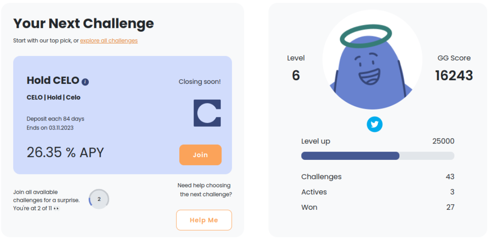
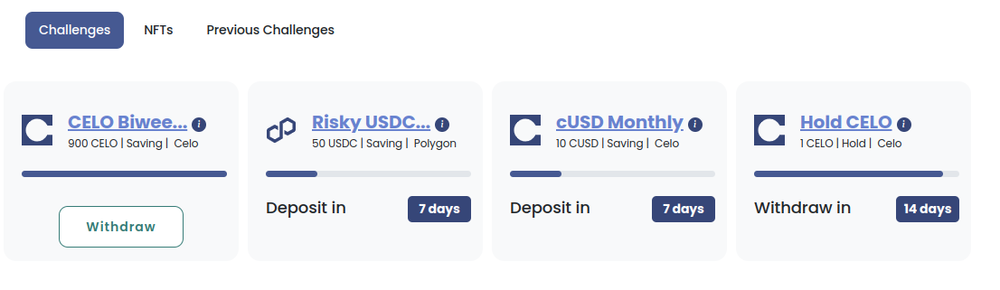
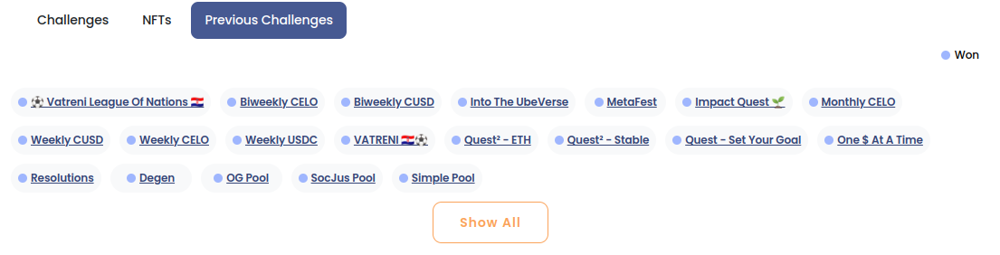
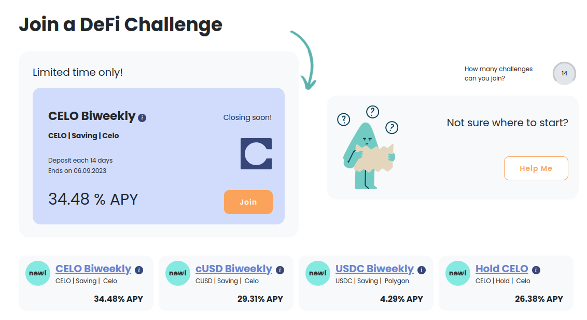

# Accessing Your Dashboard

Go to [https://app.halofi.me/#/](https://app.halofi.me/#/) and [connect your wallet](connect-on-celo/) to access your personal dashboard.&#x20;


Here you can find a new Challenge to join, and keep track of your progress.


<figure><figcaption></figcaption></figure>

Besides always finding a new challenge to join, you will see your [Halo Hero Avatar](../../halofi-challenges/halofi-heroes-levels-and-gg-score.md) and it's current Level.

At the bottom of the page, in the Challenge Cards, you can keep track of upcoming actions. Giving you a bird’s eye view of your upcoming deposits and withdrawals. You’ll now know exactly how many days are left until you can celebrate your winnings! 🎉

<figure><figcaption></figcaption></figure>

By navigating to the NFT tab, you can find the NFTs you have collected or are eligible to collect.

<figure><figcaption></figcaption></figure>

You can also find links to all the past challenges you have completed.

<figure><figcaption></figcaption></figure>

**Learn more** about your Personal Dashboard in our Blog post



<figure><figcaption>
The view before connecting your wallet
</figcaption></figure>

