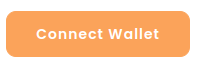
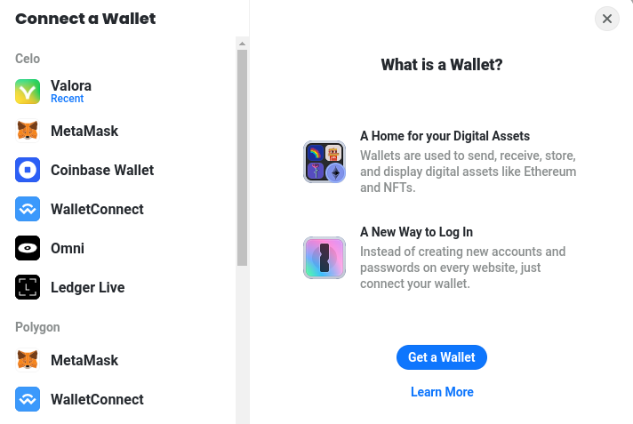
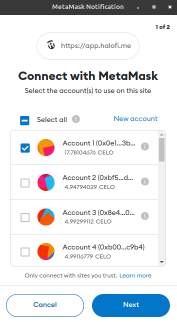
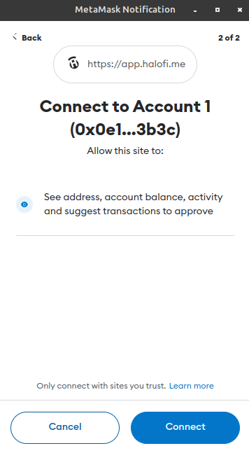
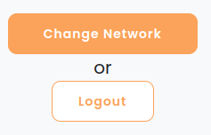

# Connect on Celo


We make use of the Celo mobile-first blockchain (PoS) to run our Celo Challenges.


## What is Celo?

Celo is a mobile optimized blockchain offering an accessible suite of financial tools to anyone with a cellphone or computer. Celo’s purpose is to empower anyone anywhere in the world to have access to financial services.



Learn more about Celo

Celo is a proof-of-stake blockchain. In comparison to Proof of Work systems like Bitcoin and Ethereum, this means that users can make transactions that are cheaper, faster, and whose outcome cannot be changed once complete. Celo is EVM-compatible and environmentally friendly. _To learn more about Celo click_ [_here_](https://celo.org/about) _or_ [_here_](https://www.kraken.com/en-us/learn/what-is-celo)_._&#x20;

> Digital tokens can easily be bridged between Celo and other blockchains. _See_ [_our guides_](../getting-cryptocurrency-tokens/)_._&#x20;

## Connecting to HaloFi on Celo

To access our services, you will need a [Web3-enabled wallet](https://docs.celo.org/getting-started/wallets), browser or mobile app that can connect to Celo_._

**Supported wallets**

* [MetaMask](https://metamask.io/) (preferred desktop app)
* [Coinbase Wallet](https://www.coinbase.com/wallet/downloads) (preferred mobile app)
* [Valora](https://valoraapp.com/) (mobile app)&#x20;
* [Rabby](https://rabby.io/) (desktop app)

Other wallets

* [Omni](https://omni.app/) (mobile)
* Injected wallets like [Frame](https://frame.sh/)
* Metamask Mobile
* Wallets using [WalletConnect](https://walletconnect.com/)
* Ledger Live

### &#x20;**1. Connect your Wallet**

Please go to your Dashboard on [https://app.halofi.me/](https://app.halofi.me/) . Click the following button:

<figure><figcaption></figcaption></figure>

Alternatively, click on `Get Started`

Your browser will present you the following options:

<figure><figcaption></figcaption></figure>

We advise to select 'MetaMask' if you are accessing the website from a laptop or desktop. For mobile users, we recommend to use either Coinbase Wallet or Valora.

How to connect your MetaMask Wallet

If it's your first time accessing HaloFi, your wallet will ask you to connect your preferred wallet account. An example how this looks like in Metamask:

Click on _Next_ and _Connect_

_Great, you're almost there! You can skip to_ [_this step_](../../../halofi-challenges/join-and-complete-a-challenge.md)_, unless you'd like to learn about Valora connections as well._

Alternatively, connect your Valora wallet

I‌f you rather use a Mobile wallet like Valora, you can select that one from the list, and follow the steps in this short video:

[https://www.youtube.com/watch?v=P5EDpWsZpjs](https://www.youtube.com/watch?v=P5EDpWsZpjs) (_note: outdated)_

Switching your wallet to the Celo network

In case your wallet is still connected to another network (e.g. Ethereum, Polygon or BSC), you will be asked to change the network in your wallet.\
\
Either click on the 'Change network' button&#x20;

or confirm the automatic prompt:

_Note that some wallets, like Frame and Rabby, automatically switch networks._\
\
Alternatively, you can use [this tool](https://chainlist.org/?search=celo) (Chainlist) to set up your wallet for Celo.

You will see your wallet is connected, in the top right corner.

<figure><figcaption>
A shortened version of your wallet address is displayed. Alternatively, if you have linked a ENS name, you will see that displayed instead.
</figcaption></figure>

You will see your wallet is connected, in the top right corner.


**Great your wallet has now been set up, and you're connected to the HaloFi website!** \
_If the_ [_Dashboard page_](broken-reference) _does not show up automatically, refresh the page._


### **2. Next Steps**


[join-and-complete-a-challenge.md](../../../halofi-challenges/join-and-complete-a-challenge.md)


> Digital tokens can easily be bridged between Celo and other blockchains. _See_ [_our guides_](../)_._&#x20;

### Something wrong?


[troubleshooting.md](../../../halofi-challenges/troubleshooting.md)

