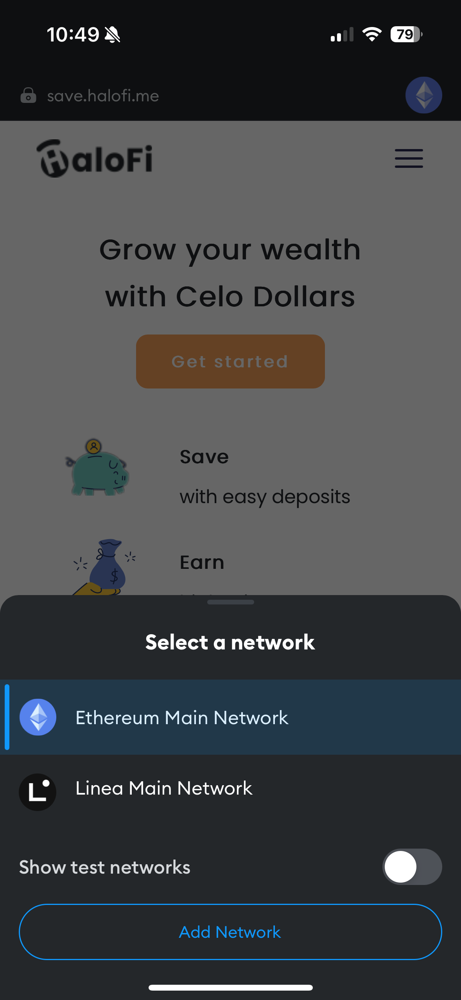
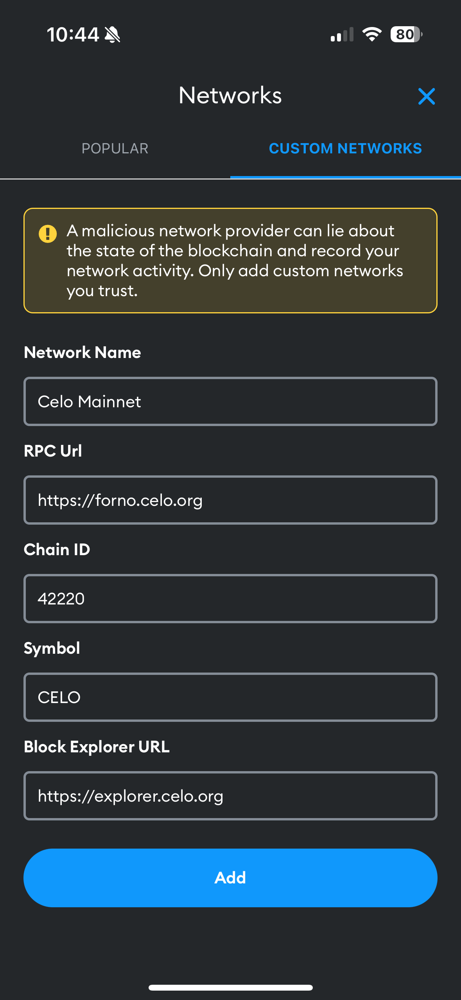
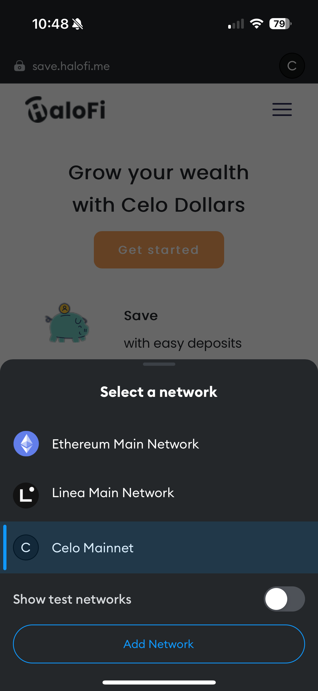

# Connect to Celo on MetaMask Mobile

1. Hit the icon of your current network in the top right corner, then select 'Add Network'.

<figure><figcaption></figcaption></figure>

2. Enter in the Celo network profile information pictured below and select 'Add'.

<figure><figcaption>
Source: Metamask Support
</figcaption></figure>



3. The Celo Mainnet should now be available on the list of networks to choose from.

<figure><figcaption></figcaption></figure>
