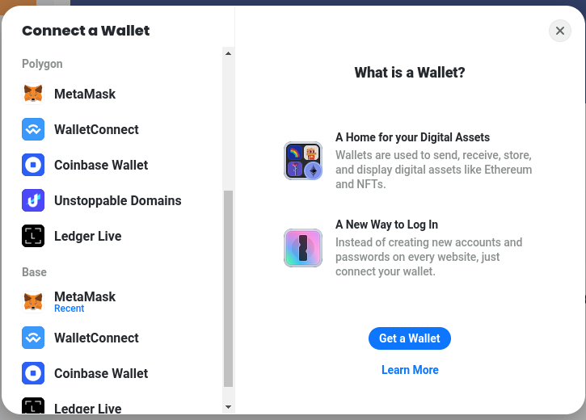
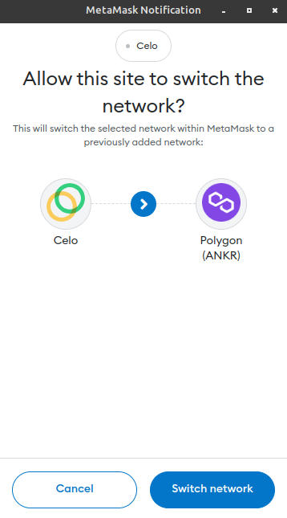

# Connect on Polygon

We make use of the Polygon 'PoS Chain' to run our Polygon savings challenges.

### What is Polygon? 

Polygon is a scaling solution for public blockchains, including Ethereum. It allows for user and developers to make use of the available Ethereum tooling (such as MetaMask and smart contracts) along with faster and cheaper transactions.Learn more about Polygon

> Digital tokens can easily be bridged between Polygon and other blockchains. _See_ [_our guides_](getting-cryptocurrency-tokens/)_._

### Connecting to HaloFi on Polygon 

To access our services, you will need a [Web3-enabled wallet](https://www.alchemy.com/list-of/web3-wallets-on-polygon), browser or mobile app that can connect to Polygon_._**Supported wallets**

* ​[MetaMask](https://metamask.io/) (preferred desktop app)
* ​[Coinbase Wallet](https://www.coinbase.com/wallet/downloads) (preferred mobile app)
* MetaMask mobile (mobile app)
* ​[Rabby](https://rabby.io/) (desktop app)

Other wallets

* [Omni](https://omni.app/) (mobile)
* Injected wallets like [Frame](https://frame.sh/)
* Wallets using [WalletConnect](https://walletconnect.com/)
* Ledger Live

### **1. Connect your Wallet** 

Please go to your Dashboard on [https://app.halofi.me/](https://app.halofi.me/) . Click the following button:

<figure><figcaption></figcaption></figure>

Alternatively, click on `Get Started`

Your browser will present you the following options:

<figure><figcaption></figcaption></figure>

We advise to select 'MetaMask' if you are accessing the website from a laptop or desktop. For mobile users, we recommend to use Coinbase Wallet.

How to connect your MetaMask Wallet

If it's your first time accessing HaloFi, your wallet will ask you to connect your preferred wallet account. An example how this looks like in Metamask:

Click on _Next_ and _Connect_

_Great, you're almost there!_

Switching your wallet to the Polygon network

In case your wallet is still connected to another network (e.g. Ethereum, Polygon, Base or BSC), you will be asked to change the network in your wallet.\

Either click on the 'Change network' button&#x20;

or confirm the automatic prompt:

_Note that some wallets, like Frame and Rabby, automatically switch networks._\
\
Alternatively, you can use [this tool](https://chainlist.org/?search=polygon) (Chainlist) to set up your wallet for Polygon.

You can see wether your wallet is connected, in the top right corner.&#x20;

<figure><figcaption>
A shortened version of your wallet address is displayed. Alternatively, if you have linked a ENS name, you will see that displayed instead.
</figcaption></figure>


**Great your wallet has now been set up, and you're connected to the HaloFi website!**  _If the_ [_Dashboard page_](https://app.halofi.me/#/dashboard) _does not show up automatically, refresh the page._


### **2. Next Steps**


[join-and-complete-a-challenge.md](../../halofi-challenges/join-and-complete-a-challenge.md)


> Digital tokens can easily be bridged between Polygon and other blockchains. _See_ [_our guides_](./)_._&#x20;

### Something wrong?


[troubleshooting.md](../../halofi-challenges/troubleshooting.md)

