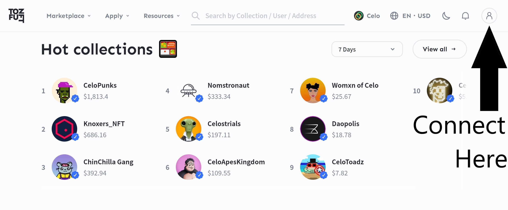
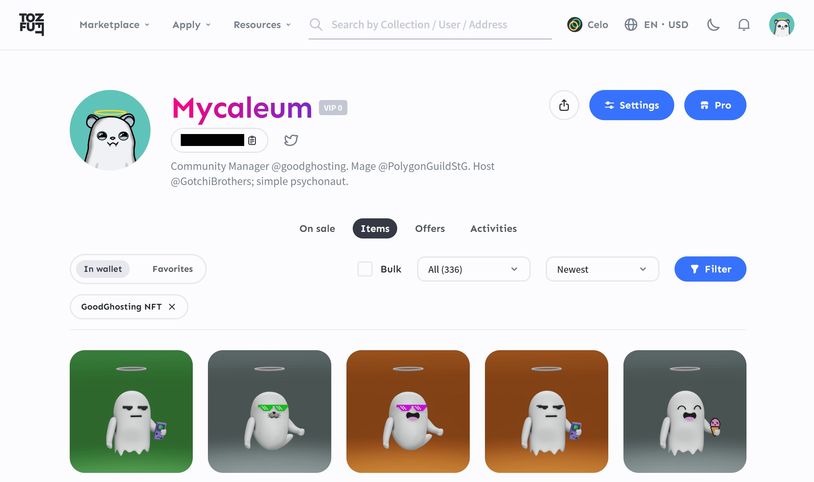
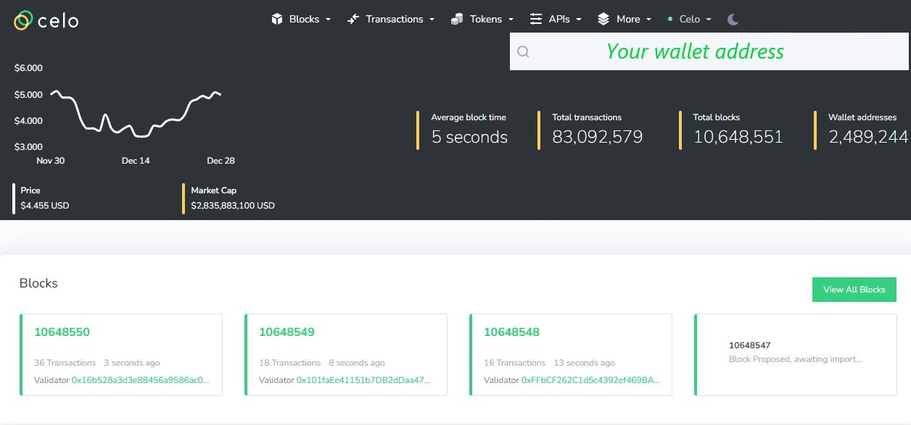
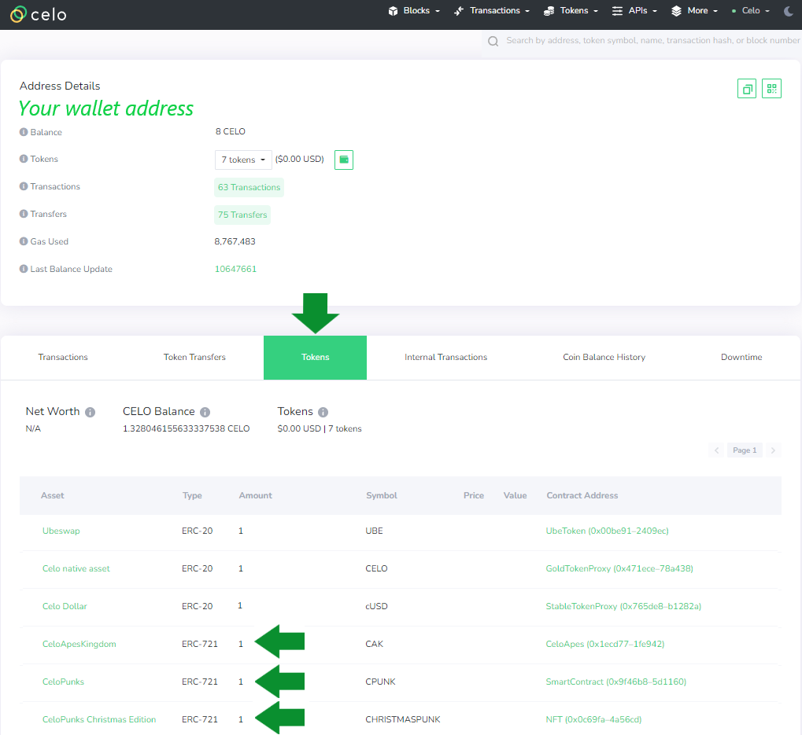

# Celo NFTs

<figure><figcaption>
Hot collections indeed. Celo is on fire!
</figcaption></figure>

Once you have connected your wallet, it is as simple as selecting your profile logo in the upper right hand corner of the website. This will take you to your wallet and display any NFTs you are holding.

<figure><figcaption>
Look at all those GoodGhosts!
</figcaption></figure>

### Celo: The "Other" Way

Though rare, sometimes you may not immediately see an NFT in your wallet through the above method. In this instance, you can use the Celo block explorer to inspect the wallet directly. This will help confirm possession of an NFT even if it is not displaying correctly in a marketplace. The block explorer can be reached at [https://explorer.celo.org/](https://explorer.celo.org/).

<figure><figcaption>
You do not need to sign in or connect in order to use the block explorer. It's like a public search engine for the Celo blockchain.
</figcaption></figure>

After you access your wallet page on the block explorer, you will want to select the **TOKENS** tab. This will show all contents of the chosen wallet, including NFTs.

<figure><figcaption></figcaption></figure>

You can see all wallet contents, including the **ERC-721** designation typical of NFTS. You can click on each NFT for more specific details and transaction specifics.

Block explorers are magic. Don't be scared to explore.
