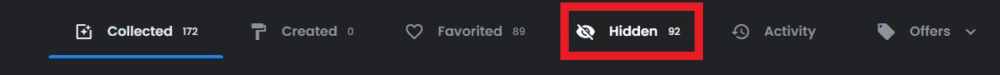

# Polygon NFTs

### Polygon: The Easy Way

The easiest way to gain visibility of your NFTs on the Polygon network is to visit an NFT marketplace such as [Opensea.io](https://opensea.io/) or [TofuNFT.com](https://tofunft.com/).

<figure><figcaption>
Select your preferred method of wallet connection. You can also put a wallet address into the search bar directly.
</figcaption></figure>


Please be sure to check the "Hidden" tab of your collection. Airdropped NFTs will usually end up in this section. Be sure to _**ONLY INTERACT**_ with NFTs you _**EXPECTED**_ to receive.


<figure><figcaption>
Only interact with hidden NFTs that you expect to receive.
</figcaption></figure>

<figure><figcaption></figcaption></figure>

Once you have located your NFT in the Hidden tab, you can select to unhide it using the Opensea menu.

### Polygon: The "Other" Way

In the rare event an NFT is not visible in your Opensea profile, you can use the Polygonscan block explorer to inspect the wallet directly. This will help confirm possession of an NFT even if it is not displaying correctly in Opensea. The block explorer can be reached at [https://polygonscan.com/](https://polygonscan.com/).

<figure><figcaption>
You do not need to sign in or connect in order to use the block explorer. It's like a public search engine for the Polygon blockchain.
</figcaption></figure>

After you access your wallet page on the block explorer, you will want to select the **ERC721** tab. This is a designation type of NFT and will filter by only these items.

<figure><figcaption>
There they are!
</figcaption></figure>

You can now see the NFTs that have recently arrived in this wallet. You can click on each NFT for more specific details and transaction specifics. You can even take the NFT contract address and plug it into [Opensea.io](https://www.opensea.io) for a possible direct viewing.

The labyrinth of the block explorer is vast. Feel free to explore its halls. Much learning.
